```mermaid
erDiagram
    %% Entidades de Usuários e Autenticação
    USUARIO {
        uuid id PK
        string cpf UK "CPF único"
        string email UK
        string nome_completo
        string telefone
        date data_nascimento
        timestamp criado_em
        timestamp atualizado_em
        boolean ativo
        timestamp ultimo_acesso
    }

    AUTENTICACAO {
        uuid id PK
        uuid usuario_id FK
        string senha_hash
        string biometria_token
        string device_id
        timestamp ultimo_login
        int tentativas_falhas
        boolean bloqueado
        timestamp bloqueado_ate
    }

    STELLAR_WALLET {
        uuid id PK
        uuid usuario_id FK
        string public_key UK "Stellar Public Address"
        boolean principal
        timestamp criado_em
        boolean ativo
        string wallet_type "HOT, COLD"
    }

    %% Entidades de Perfil e Score
    PERFIL_INVESTIDOR {
        uuid id PK
        uuid usuario_id FK
        decimal saldo_disponivel
        decimal total_investido
        decimal retorno_acumulado
        enum perfil_risco "CONSERVADOR, MODERADO, ARROJADO"
        jsonb preferencias
        timestamp atualizado_em
    }

    PERFIL_TOMADOR {
        uuid id PK
        uuid usuario_id FK
        decimal renda_mensal
        enum ocupacao "EMPREGADO, AUTONOMO, EMPRESARIO, APOSENTADO"
        string empresa
        decimal limite_credito
        decimal credito_utilizado
        timestamp atualizado_em
    }

    SCORE_CREDITO {
        uuid id PK
        uuid usuario_id FK
        int score_interno "0-1000"
        int score_serasa
        int score_open_finance
        int score_consolidado
        enum classificacao "EXCELENTE, BOM, REGULAR, RUIM"
        jsonb detalhamento
        timestamp calculado_em
        timestamp valido_ate
    }

    SCORE_INVESTIDOR {
        uuid id PK
        uuid usuario_id FK
        int score_investidor "0-1000"
        enum classificacao "EXCELENTE, BOM, REGULAR, RUIM"
        jsonb fatores
        timestamp calculado_em
    }

    HISTORICO_SCORE {
        uuid id PK
        uuid score_credito_id FK
        int score_anterior
        int score_novo
        string motivo_alteracao
        jsonb dados_calculo
        timestamp registrado_em
    }

    %% Entidades de Crédito e Investimento
    SOLICITACAO_CREDITO {
        uuid id PK
        uuid tomador_id FK
        decimal valor_solicitado
        int prazo_meses
        enum finalidade "PESSOAL, EDUCACAO, SAUDE, NEGOCIO, OUTROS"
        string descricao
        enum status "PENDENTE, ANALISE, APROVADO, REPROVADO, CANCELADO"
        decimal taxa_juros_sugerida
        jsonb analise_ia
        timestamp solicitado_em
        timestamp respondido_em
    }

    OFERTA_INVESTIMENTO {
        uuid id PK
        uuid solicitacao_credito_id FK
        uuid investidor_id FK
        decimal valor_ofertado
        decimal taxa_juros_oferecida
        enum status "PENDENTE, ACEITA, RECUSADA, EXPIRADA"
        string mensagem
        timestamp criado_em
        timestamp expira_em
        timestamp respondido_em
    }

    CONTRATO {
        uuid id PK
        uuid solicitacao_credito_id FK
        uuid oferta_investimento_id FK
        uuid tomador_id FK
        uuid investidor_id FK
        decimal valor_total
        decimal taxa_juros
        int prazo_meses
        decimal valor_parcela
        date data_primeiro_vencimento
        enum status "ATIVO, QUITADO, INADIMPLENTE, CANCELADO"
        string documento_hash "Hash do contrato"
        string stellar_tx_id "ID da transação Stellar"
        timestamp assinado_em
        timestamp criado_em
    }

    PARCELA {
        uuid id PK
        uuid contrato_id FK
        int numero_parcela
        decimal valor_principal
        decimal valor_juros
        decimal valor_total
        date data_vencimento
        date data_pagamento
        enum status "PENDENTE, PAGO, ATRASADO, CANCELADO"
        decimal multa
        decimal juros_atraso
        string stellar_tx_id
        timestamp criado_em
    }

    %% Transações Blockchain
    TRANSACAO_STELLAR {
        uuid id PK
        string stellar_tx_hash UK
        uuid usuario_origem_id FK
        uuid usuario_destino_id FK
        string conta_origem
        string conta_destino
        decimal valor
        enum tipo "TRANSFERENCIA, PAGAMENTO_PARCELA, INVESTIMENTO, RESGATE"
        enum status "PENDENTE, CONFIRMADA, FALHA"
        jsonb metadados
        timestamp submetido_em
        timestamp confirmado_em
        int ledger_sequence
    }

    FEE_CONFIG {
        uuid id PK
        string tipo "MITHRIL, FUNDO_INADIMPLENCIA, PIX, CAMBIAL"
        decimal percentual
        decimal valor_fixo
        timestamp atualizado_em
    }
    
    FUNDO_INADIMPLENCIA {
        uuid id PK
        decimal saldo_atual
        decimal total_reservado
        decimal total_utilizado
        timestamp atualizado_em
    }

    MOVIMENTACAO_FINANCEIRA {
        uuid id PK
        uuid usuario_id FK
        uuid origem_id
        uuid destino_id
        enum tipo "DEPOSITO, SAQUE, INVESTIMENTO, PAGAMENTO, TAXA, RENDIMENTO"
        decimal valor
        string descricao
        timestamp criado_em
    }

    SMART_CONTRACT {
        uuid id PK
        string contract_id UK
        string nome
        string descricao
        string rede "TESTNET, MAINNET"
        string endereco_deploy
        string wasm_hash
        timestamp criado_em
    }

    CONVERSAO_CAMBIAL {
        uuid id PK
        uuid usuario_id FK
        string par_moeda "BRL/USDC"
        decimal taxa_conversao
        decimal valor_origem
        decimal valor_destino
        string stellar_tx_id
        timestamp executado_em
    }

    AUDITORIA_BLOCKCHAIN {
        uuid id PK
        uuid transacao_stellar_id FK
        string evento
        jsonb dados_transacao
        string ip_origem
        string user_agent
        timestamp registrado_em
    }

    %% Detecção de Fraude
    ANALISE_FRAUDE {
        uuid id PK
        uuid usuario_id FK
        uuid transacao_stellar_id FK
        decimal score_fraude "0-100"
        enum classificacao "BAIXO, MEDIO, ALTO, CRITICO"
        jsonb features_ml
        string modelo_versao
        boolean bloqueado
        string motivo_bloqueio
        timestamp analisado_em
    }

    ALERTA_FRAUDE {
        uuid id PK
        uuid analise_fraude_id FK
        enum tipo_alerta "PADRAO_SUSPEITO, VALOR_ANOMALO, FREQUENCIA_ALTA, DISPOSITIVO_NOVO"
        enum severidade "BAIXA, MEDIA, ALTA, CRITICA"
        string descricao
        jsonb detalhes
        boolean resolvido
        string resolucao
        timestamp criado_em
        timestamp resolvido_em
    }

    %% Recomendações
    RECOMENDACAO {
        uuid id PK
        uuid usuario_id FK
        uuid solicitacao_credito_id FK
        enum tipo "INVESTIMENTO, CREDITO, PRODUTO"
        decimal score_recomendacao
        string titulo
        string descricao
        jsonb parametros
        boolean visualizado
        boolean aceito
        timestamp criado_em
        timestamp expira_em
    }

    %% LGPD e Consentimentos
    CONSENTIMENTO_LGPD {
        uuid id PK
        uuid usuario_id FK
        enum tipo_consentimento "DADOS_PESSOAIS, CONSULTA_CREDITO, OPEN_FINANCE, MARKETING"
        boolean consentido
        string ip_consentimento
        timestamp consentido_em
        timestamp revogado_em
        string finalidade
    }

    %% Integrações Externas
    CONSULTA_SERASA {
        uuid id PK
        uuid usuario_id FK
        int score_retornado
        jsonb dados_completos
        timestamp consultado_em
        string protocolo_serasa
    }

    DADOS_OPEN_FINANCE {
        uuid id PK
        uuid usuario_id FK
        string instituicao
        jsonb contas
        jsonb transacoes
        jsonb investimentos
        timestamp sincronizado_em
        timestamp expira_em
    }

    TRANSACAO_PIX {
        uuid id PK
        uuid usuario_id FK
        uuid transacao_stellar_id FK
        string pix_id UK
        decimal valor
        enum tipo "ENTRADA, SAIDA"
        string chave_pix
        enum status "PENDENTE, CONCLUIDA, FALHA"
        timestamp criado_em
    }

    %% Chat e Suporte
    CONVERSA_CHAT {
        uuid id PK
        uuid usuario_id FK
        string titulo
        enum status "ABERTA, RESOLVIDA, FECHADA"
        timestamp iniciado_em
        timestamp atualizado_em
    }

    MENSAGEM_CHAT {
        uuid id PK
        uuid conversa_id FK
        enum remetente "USUARIO, BOT, ATENDENTE"
        text conteudo
        jsonb metadados
        boolean visualizado
        timestamp enviado_em
    }

    %% ========================================
    %% RELACIONAMENTOS COMPLETOS
    %% ========================================
    
    %% USUARIO - Autenticação e Carteiras
    USUARIO ||--o{ AUTENTICACAO : "possui histórico"
    USUARIO ||--o{ STELLAR_WALLET : "possui carteiras"
    
    %% USUARIO - Perfis (1:1 opcional)
    USUARIO ||--o| PERFIL_INVESTIDOR : "tem perfil"
    USUARIO ||--o| PERFIL_TOMADOR : "tem perfil"
    
    %% USUARIO - Scores
    USUARIO ||--o{ SCORE_CREDITO : "tem histórico score"
    USUARIO ||--o{ SCORE_INVESTIDOR : "tem avaliação"
    
    %% USUARIO - Movimentações Financeiras
    USUARIO ||--o{ MOVIMENTACAO_FINANCEIRA : "realiza movimentação"
    USUARIO ||--o{ CONVERSAO_CAMBIAL : "executa conversão"
    
    %% USUARIO - Como Tomador
    USUARIO ||--o{ SOLICITACAO_CREDITO : "solicita crédito"
    USUARIO ||--o{ CONTRATO : "é tomador em"
    
    %% USUARIO - Como Investidor
    USUARIO ||--o{ OFERTA_INVESTIMENTO : "oferece investimento"
    USUARIO ||--o{ CONTRATO : "é investidor em"
    
    %% USUARIO - Transações (origem e destino)
    USUARIO ||--o{ TRANSACAO_STELLAR : "origina transação"
    USUARIO ||--o{ TRANSACAO_STELLAR : "recebe transação"
    
    %% USUARIO - Análises e Segurança
    USUARIO ||--o{ ANALISE_FRAUDE : "é analisado"
    USUARIO ||--o{ RECOMENDACAO : "recebe recomendação"
    
    %% USUARIO - LGPD e Compliance
    USUARIO ||--o{ CONSENTIMENTO_LGPD : "fornece consentimento"
    
    %% USUARIO - Integrações Externas
    USUARIO ||--o{ CONSULTA_SERASA : "tem consulta"
    USUARIO ||--o{ DADOS_OPEN_FINANCE : "sincroniza dados"
    USUARIO ||--o{ TRANSACAO_PIX : "realiza PIX"
    
    %% USUARIO - Chat
    USUARIO ||--o{ CONVERSA_CHAT : "participa de"
    
    %% SCORE - Histórico
    SCORE_CREDITO ||--o{ HISTORICO_SCORE : "gera histórico"
    
    %% CONSULTA_SERASA - Atualiza SCORE_CREDITO
    CONSULTA_SERASA }o--|| SCORE_CREDITO : "atualiza"
    
    %% DADOS_OPEN_FINANCE - Influencia SCORE_CREDITO
    DADOS_OPEN_FINANCE }o--|| SCORE_CREDITO : "influencia"
    
    %% Fluxo de Crédito P2P
    SOLICITACAO_CREDITO ||--o{ OFERTA_INVESTIMENTO : "recebe ofertas"
    SOLICITACAO_CREDITO ||--o| CONTRATO : "origina contrato"
    OFERTA_INVESTIMENTO ||--o| CONTRATO : "concretiza em"
    
    %% SOLICITACAO_CREDITO - Recomendações
    SOLICITACAO_CREDITO ||--o{ RECOMENDACAO : "gera recomendação"
    
    %% Contratos e Parcelas
    CONTRATO ||--|{ PARCELA : "divide em"
    
    %% CONTRATO - Vincula Smart Contract
    CONTRATO }o--o| SMART_CONTRACT : "executado por"
    
    %% PARCELA - Transações
    PARCELA }o--o| TRANSACAO_STELLAR : "paga via"
    
    %% TRANSACAO_STELLAR - Auditoria e Análises
    TRANSACAO_STELLAR ||--o| AUDITORIA_BLOCKCHAIN : "auditada em"
    TRANSACAO_STELLAR ||--o{ ANALISE_FRAUDE : "analisada em"
    TRANSACAO_STELLAR ||--o| TRANSACAO_PIX : "vincula PIX"
    
    %% TRANSACAO_STELLAR - Smart Contract
    TRANSACAO_STELLAR }o--o| SMART_CONTRACT : "executada por"
    
    %% TRANSACAO_STELLAR - Movimentação Financeira
    TRANSACAO_STELLAR ||--o| MOVIMENTACAO_FINANCEIRA : "registra em"
    
    %% CONVERSAO_CAMBIAL - Transação Stellar
    CONVERSAO_CAMBIAL }o--|| TRANSACAO_STELLAR : "realizada via"
    
    %% Detecção de Fraude
    ANALISE_FRAUDE ||--o{ ALERTA_FRAUDE : "gera alertas"
    
    %% FEE_CONFIG - Aplicada em Transações
    FEE_CONFIG }o--o{ TRANSACAO_STELLAR : "taxa aplicada em"
    FEE_CONFIG }o--o{ TRANSACAO_PIX : "taxa aplicada em"
    FEE_CONFIG }o--o{ CONVERSAO_CAMBIAL : "taxa aplicada em"
    
    %% FUNDO_INADIMPLENCIA - Parcelas Inadimplentes
    FUNDO_INADIMPLENCIA }o--o{ PARCELA : "cobre inadimplência"
    FUNDO_INADIMPLENCIA }o--o{ CONTRATO : "protege contrato"
    
    %% Chat
    CONVERSA_CHAT ||--|{ MENSAGEM_CHAT : "contém mensagens"
    
    %% MOVIMENTACAO_FINANCEIRA - Origem/Destino podem ser várias entidades
    CONTRATO }o--o{ MOVIMENTACAO_FINANCEIRA : "origina movimento"
    PARCELA }o--o{ MOVIMENTACAO_FINANCEIRA : "registra pagamento"
```

import useBaseUrl from '@docusaurus/useBaseUrl';

&emsp; Este documento descreve a modelagem do banco de dados do sistema, que integra funcionalidades de carteira digital, infraestrutura P2P, avaliação de crédito, investimentos, transações via Stellar Blockchain, detecção de fraude, LGPD e chat de suporte. Ademais, a modelagem foi desenvolvida para garantir escalabilidade, integridade referencial, segurança de dados e suporte a análises avançadas via Machine Learning, mantendo aderência a normas regulatórias (LGPD, Banco Central e Open Finance).

## Objetivos

1. **Gestão de usuários e autenticação**: controle de acesso, wallets Stellar, dispositivos e biometria.
2. **Perfis e score de crédito**: unificar dados internos, Serasa e Open Finance em um score consolidado.
3. **Fluxo de crédito e investimento P2P**: permitir solicitações de crédito, ofertas de investimento, contratos e parcelas.
4. **Integração com Stellar e PIX**: garantir rastreabilidade das transações financeiras.
5. **Segurança antifraude**: análise em tempo real, alertas e bloqueios automatizados.
6. **Atendimento e experiência do usuário**: recomendações personalizadas, chat e suporte integrado.
7. **Compliance regulatório (LGPD)**: consentimentos explícitos e rastreamento de uso de dados.

## Estrutura do Banco

&emsp; A modelagem foi estruturada em um banco de dados relacional (PostgreSQL), utilizando UUIDs como identificadores primários para todas as entidades, além de recursos como JSONB para flexibilidade de dados, enums para padronização de classificações e tabelas de histórico para rastreabilidade.

&emsp; O código abaixo representa um diagrama com a organização das entidades e seus relacionamentos principais. A visualização do diagrama está disponível [aqui](https://www.mermaidchart.com/d/790a16d5-b2ad-446a-ab7e-109478876d87).

  
<strong>Figura 1 - Modelagem do Banco de Dados</strong>

  
  
Fonte: Elaborado pelos autores (2025)

